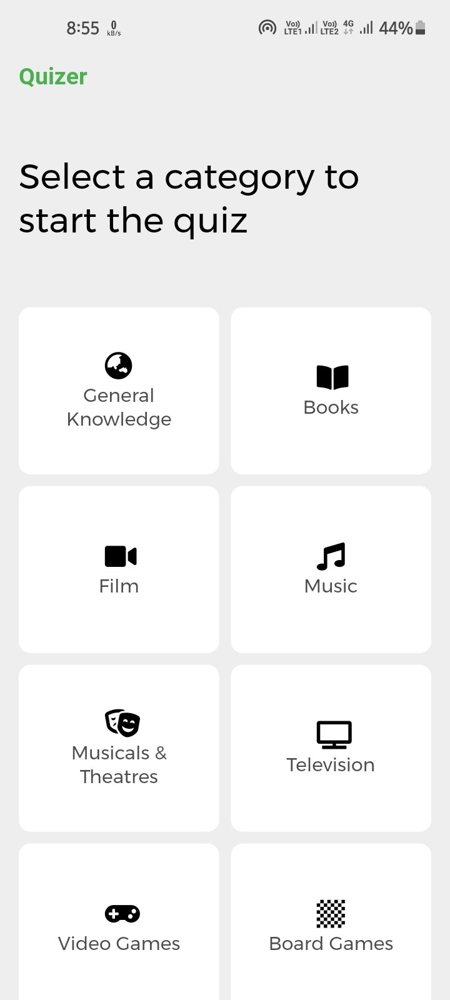
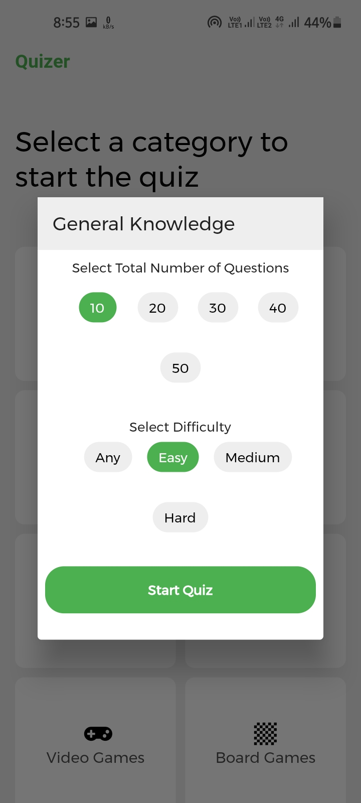
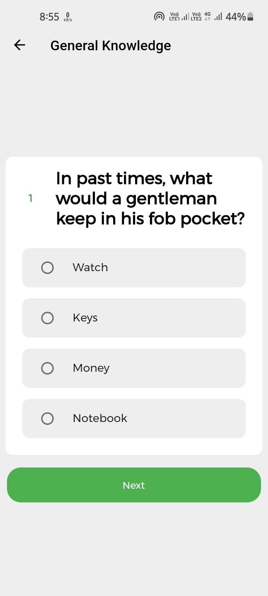
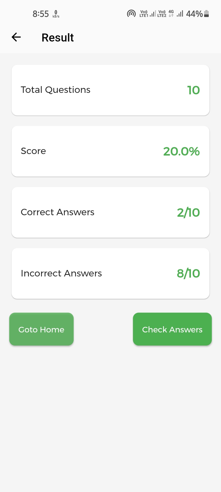
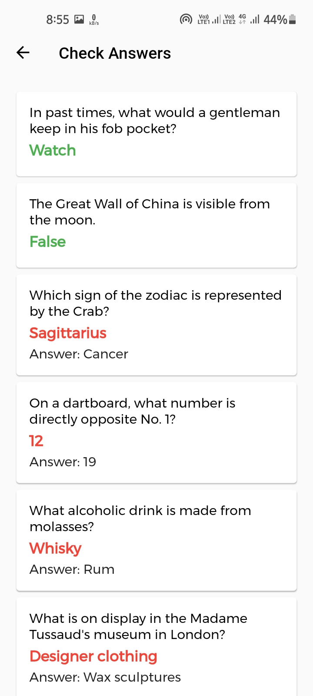

# quizer


A new Flutter project with [OpenTdb Api](https://opentdb.com/api_config.php).

- An About open Trivia Questions with all catagories.
- It's simple App with http GET requests.
  </br>
  </br>

## Packages used

- cupertino_icons: ^1.0.2
- font_awesome_flutter: ^9.0.0
- google_fonts: ^2.1.0
- html_unescape: ^2.0.0
- http: ^0.13.3

  <br>
  <br>

## Screenshots

<br>
<p align="center">






</p>

## How to use

To clone and run this application, you'll need [Git](https://git-scm.com/downloads) and [Flutter](https://flutter.dev/docs/get-started/install) installed on your computer. From your command line:

```
# Clone this repository
$ git clone https://github.com/Appii00/Flutter-Quizer-App

# Go into the repository
$ cd Flutter-Quizer-App

# Install dependencies
$ flutter packages get

# Run the app
$ flutter run
```

**Download _.apk_ file from [Here](https://mega.nz/file/7182AIqB#r-PCh4GespZOKq6ynDlfRgs8kDB7TMYR0vBA94yT0MA)**
